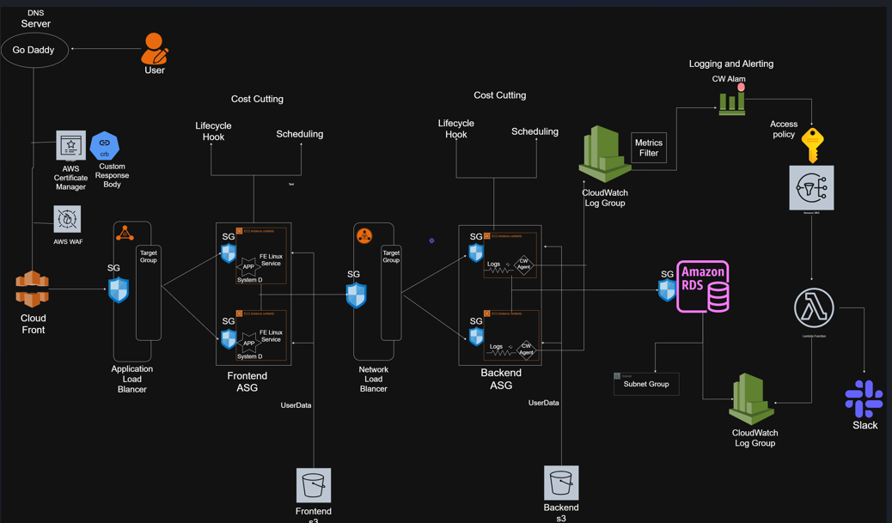

# 🚀 FULL STACK AWS PROJECT – MANUAL DEPLOYMENT (STEP-BY-STEP)

This project was created manually using the AWS Console following a structured, production-grade approach — from networking to security hardening, monitoring, CDN, WAF, DNS, lifecycle management, and cost optimization.

---
# Architecture Diagram

---
# 🔷 PHASE 1 — NETWORK SETUP

This phase establishes the foundational networking layer for the entire infrastructure using a multi-AZ, production-ready design.

---

## 1️⃣ Create VPC

### 📌 Configuration

    Name: dev-vpc
    CIDR Block: 10.0.0.0/16

### 🎯 Purpose

- Creates an isolated virtual network
- Provides up to 65,536 private IP addresses
- Forms the base for all infrastructure components

---

## 2️⃣ Create Subnets (Multi-AZ)

To ensure **high availability**, subnets were distributed across three Availability Zones.

---

### 🌍 Public Subnets

    dev-pub-sub-1 → us-east-1a → 10.0.0.0/24
    dev-pub-sub-2 → us-east-1b → 10.0.1.0/24
    dev-pub-sub-3 → us-east-1c → 10.0.2.0/24

Used for:
- ALB
- NAT Gateway
- Bastion Host

---

### 🔒 Private Subnets

    dev-pvt-sub-1 → us-east-1a → 10.0.3.0/24
    dev-pvt-sub-2 → us-east-1b → 10.0.4.0/24
    dev-pvt-sub-3 → us-east-1c → 10.0.5.0/24

Used for:
- Frontend EC2
- Backend EC2
- RDS Database

---

## 3️⃣ Create Internet Gateway (IGW)

### 📌 Steps

- Create Internet Gateway
- Attach it to **dev-vpc**

### 🎯 Purpose

Allows **public subnets** to communicate with the internet.

---

## 4️⃣ Create NAT Gateway

### 📌 Configuration

- Created manually
- Placed in: Public Subnet (1a)
- Attached: Elastic IP

### 🎯 Purpose

Allows **private instances** to access the internet securely:

- OS updates
- Package downloads
- External API calls

Without exposing them publicly.

---

## 5️⃣ Configure Route Tables

---

### 🌐 Public Route Table

    Route:
    0.0.0.0/0 → Internet Gateway

Attached to:

    dev-pub-sub-1
    dev-pub-sub-2
    dev-pub-sub-3

---

### 🔒 Private Route Table

    Route:
    0.0.0.0/0 → NAT Gateway

Attached to:

    dev-pvt-sub-1
    dev-pvt-sub-2
    dev-pvt-sub-3

---

## 🔄 Network Traffic Flow

### Public Subnet Traffic

    Public EC2 / ALB
           ↓
    Internet Gateway
           ↓
    Internet

### Private Subnet Traffic

    Private EC2
           ↓
    NAT Gateway
           ↓
    Internet Gateway
           ↓
    Internet

---

## 6️⃣ Enable VPC Flow Logs

Enabled **VPC Flow Logs** to:

- Monitor inbound and outbound traffic
- Analyze network behavior
- Debug connectivity issues
- Improve visibility and security auditing

---

# 🔷 PHASE 2 — SECURITY GROUP DESIGN (LAYERED SECURITY)

Security was designed using a strict **layered architecture**.

Each layer communicates only with the required upstream/downstream component.

---

## 7️⃣ Create Security Groups

---

### 🌐 ALB Security Group

    HTTP (80) → 0.0.0.0/0

Allows public internet traffic to reach the ALB only.

---

### 🖥 Frontend Security Group

    TCP 8501 → Source: ALB Security Group

Allows traffic only from the ALB.

---

### 🔁 NLB Security Group

    TCP 80 → Source: Frontend Security Group

Allows internal traffic from Frontend only.

---

### ⚙ Backend Security Group

    TCP 8084 → Source: NLB Security Group

Backend is not publicly accessible.

---

### 🗄 RDS Security Group

    MySQL / Aurora → Port 3306
    Source → Backend Security Group

Database access is strictly limited to backend services.

---

## 🔐 Layered Security Architecture

    Internet
       ↓
    ALB (Public)
       ↓
    Frontend EC2
       ↓
    Internal NLB
       ↓
    Backend EC2
       ↓
    RDS

---

# 🔷 PHASE 3 — DATABASE CONFIGURATION

This phase focuses on deploying a secure, production-ready relational database inside private subnets.

---

## 8️⃣ Create DB Subnet Group

### 📌 Included Subnets

    Private Subnet 1a
    Private Subnet 1b
    Private Subnet 1c

### 🎯 Purpose

- Enables **Multi-AZ deployment**
- Ensures high availability
- Allows automatic failover across Availability Zones
- Keeps database inside private network

---

## 9️⃣ Create RDS Instance

### 📌 Configuration

    Engine: MySQL / Aurora
    Public Access: Disabled
    Subnet Group: Private Subnets
    Security Group: RDS SG
    Logging: Enabled
    Encryption: Enabled (KMS)

---

### 🔐 Security Design

- Database is NOT publicly accessible
- Only backend security group can access port 3306
- Logging enabled for monitoring
- Encryption enabled for compliance and data protection

---

## 🔐 Encryption Configuration

### 🔒 Encryption at Rest

- Data is encrypted before being written to storage
- Protects against unauthorized disk-level access
- Uses AWS KMS

---

### 🔁 Encryption in Transit

- Data is encrypted while moving between services
- Protects credentials and queries
- Uses SSL/TLS

---

## 🔄 Database Access Flow

    Backend EC2
         ↓
    RDS (Private Subnet)
         ↓
    Encrypted Storage

---

# 🔷 PHASE 4 — ACCESS MANAGEMENT & SECRETS

This phase focuses on secure instance access and secret management.

---

## 🔟 Configure Systems Manager (SSM) Access

You configured **AWS Systems Manager (SSM)** to access EC2 instances securely.

### 🎯 Benefits

- No Bastion Host required
- No public IP required
- Secure shell access via IAM
- Encrypted session management
- Full audit logging

---

### 🔄 Access Flow Using SSM

    Developer
        ↓
    AWS Console / CLI
        ↓
    Systems Manager
        ↓
    Private EC2 Instance

This removes the need for SSH over the internet.

---

## 1️⃣1️⃣ Create Parameters in Systems Manager (Parameter Store)

You securely stored database credentials using **Parameter Store**.

---

### 📦 Parameters Created

---

### (i) Database Host

    Name: /cheetah/dev/mysql/host
    Type: String
    Value: RDS Endpoint

---

### (ii) Database Username

    Name: /cheetah/dev/mysql/username
    Type: String
    Value: admin

---

### (iii) Database Password

    Name: /cheetah/dev/mysql/password
    Type: SecureString
    Encryption: KMS
    Value: RDS Password

---

## 🔐 Why This Is Secure

- ✔ No hardcoded credentials in application code
- ✔ Password stored as SecureString
- ✔ Encrypted using KMS
- ✔ IAM-based access control
- ✔ Centralized secret management

---

## 🔄 Secure Credential Retrieval Flow

    Application
         ↓
    IAM Role
         ↓
    Parameter Store
         ↓
    Decrypted value (if authorized)

Only instances with proper IAM permissions can retrieve the secrets.

---

# 🔷 PHASE 5 — APPLICATION ARTIFACT STORAGE

This phase prepares centralized storage for application artifacts used during deployment.

---

## 1️⃣2️⃣ Create S3 Bucket

### 📌 Actions Performed

- Created an **S3 bucket**
- Uploaded:

      Backend JAR file

### 🎯 Purpose

- Store application artifacts securely
- Allow EC2 instances to download code during bootstrapping
- Enable automated deployments via user data or scripts
- Maintain centralized artifact management

---

## 🔄 Artifact Deployment Flow

    S3 Bucket
        ↓
    EC2 Instance (via IAM Role)
        ↓
    Backend Application Starts

EC2 retrieves the JAR file during initialization.

---

# 🔷 PHASE 6 — IAM ROLE FOR EC2

This phase ensures EC2 instances have secure, least-privilege access to required AWS services.

---

## 1️⃣3️⃣ Create IAM Role (For EC2)

### 📌 AWS Managed Policies Attached

- AmazonSSMManagedInstanceCore
- S3 Full Access
- CloudWatchAgentServerPolicy

These allow:

- SSM access
- S3 artifact download
- CloudWatch logging

---

## 🔐 Custom Policy Created

### 📌 Permissions Added

    ssm:GetParameter
    kms:Decrypt

### 🎯 Purpose

- Retrieve database credentials from Parameter Store
- Decrypt SecureString values encrypted with KMS

The custom policy was attached to the EC2 IAM Role.

---

## 🔄 IAM Role Capability Summary

The EC2 instance can now:

- ✔ Fetch secure DB credentials
- ✔ Access S3 bucket artifacts
- ✔ Allow SSM login (no SSH required)
- ✔ Publish logs to CloudWatch
- ✔ Decrypt encrypted parameters via KMS

---

# 🔷 PHASE 7 — BACKEND DEPLOYMENT TEST

Before automating deployment with Launch Templates and Auto Scaling, you performed a manual validation.

---

## 1️⃣4️⃣ Launch EC2 Instance (Testing)

### 📌 Configuration

    Instance Type: t2.medium
    Subnet: Private Subnet 2
    IAM Role: Attached
    Security Group: Backend SG

---

### 🎯 Purpose of This Test Instance

- Verify IAM role permissions
- Test Parameter Store access
- Validate S3 artifact download
- Confirm backend application starts successfully
- Ensure DB connectivity works
- Debug issues before automation

---

## 🔄 Manual Testing Flow

    EC2 (Private Subnet)
         ↓
    Retrieve DB credentials from Parameter Store
         ↓
    Download JAR from S3
         ↓
    Start Backend Application
         ↓
    Connect to RDS (Port 3306)

---
# 🔷 PHASE 8 — CREATE LAUNCH TEMPLATE (BACKEND)

This phase automates backend instance provisioning using a Launch Template.

---

## 1️⃣5️⃣ Create Launch Template

### 📌 Configuration

    Instance Type: t2.medium
    Key Pair: Attached
    Security Group: Backend SG
    IAM Role: Attached
    User Data: Added

---

## 🧾 User Data Responsibilities

The User Data script automatically:

- Install Java
- Download JAR file from S3
- Fetch DB credentials from SSM Parameter Store
- Decrypt password using KMS
- Start Spring Boot application on:

      Port 8084

---

## 🔄 Backend Boot Flow

    EC2 Launch
        ↓
    Install Java
        ↓
    Download Backend JAR (S3)
        ↓
    Fetch DB Credentials (SSM)
        ↓
    Start Spring Boot App (8084)

This ensures fully automated backend deployment.

---

# 🔷 PHASE 9 — CREATE TARGET GROUP (BACKEND)

The Target Group monitors backend instance health.

---

## 1️⃣6️⃣ Create Target Group

### 📌 Configuration

    Protocol: TCP
    Port: 8084

### 🏥 Health Check Configuration

    Protocol: HTTP
    Port: Override → 8084
    Success Code: 200–499

---

### 🎯 Purpose

- Confirms backend application is running
- Ensures only healthy instances receive traffic
- Integrates with Load Balancer and ASG

---

# 🔷 PHASE 10 — BACKEND LOAD BALANCING & AUTO SCALING

This phase ensures backend scalability and high availability.

---

## 1️⃣7️⃣ Create Internal Network Load Balancer (NLB)

### 📌 Configuration

    Type: Internal
    Subnets: Private Subnet 1 & 2 (Multi-AZ)
    Listener: TCP 80
    Forward to: Backend Target Group

---

### 🎯 Purpose

- Exposes backend only inside VPC
- No public internet access
- Used by frontend instances internally

---

## 🔄 Backend Traffic Flow

    Frontend EC2
         ↓
    Internal NLB (Private)
         ↓
    Backend Target Group
         ↓
    Backend EC2 Instances

---

## 1️⃣8️⃣ Create Backend Auto Scaling Group (ASG)

### 📌 Configuration

    Launch Template: Backend LT
    Subnets: Private Subnet 1 & 2
    Attach to: Backend Target Group
    Health Check Type: ELB
    Desired Capacity: 1

---

### 🛡 Health Check Behavior

- Target Group checks backend process
- If unhealthy → ASG terminates instance
- New instance launched automatically

---

# 🔷 PHASE 11 — INSTANCE VERIFICATION & LOG CHECK

After deployment, manual verification was performed.

---

## 1️⃣9️⃣ Connect via SSM

Used **Systems Manager Session Manager** to log into private EC2.

No public IP or SSH required.

---

## 🔎 Commands Used

### Check Java Process

    ps -aux | grep java

### Check Application Logs

    cd /var/log/app
    cat datastore.log

### Kill Process (Health Check Testing)

    kill <PID>

---

## 🔄 Health Check Validation Flow

    Kill Backend Process
           ↓
    Target Group Marks Unhealthy
           ↓
    ASG Terminates Instance
           ↓
    New Instance Launched
           ↓
    Application Restored

---

# 🔷 PHASE 12 — MONITORING SETUP (CloudWatch)

This phase establishes real-time monitoring and alerting for backend application errors.

---

## 2️⃣0️⃣ Create CloudWatch Log Group

### 📌 Configuration

    Log Level: INFO
    Log Group Name: /datastore/app

### 🎯 Purpose

- Store backend application logs
- Centralize log visibility
- Enable metric filters and alarms

All application logs are shipped to:

    /datastore/app

---

## 2️⃣1️⃣ Create Metric Filter

Inside the CloudWatch Log Group, a metric filter was created.

### 📌 Filter Pattern

    ERROR

### 📊 Metric Details

    Namespace: be-cw-ns
    Metric Name: log-error
    Metric Value: 1

---

### 🎯 Purpose

Whenever the word:

    ERROR

appears in the logs:

- The metric `log-error` increments by 1
- Enables automated monitoring of backend failures

---

## 2️⃣2️⃣ Create CloudWatch Alarm

### 📌 Configuration

    Metric: log-error
    Statistic: Sum
    Period: 1 minute
    Threshold: ≥ 1
    Condition: Greater than or equal to 1

### 🚨 Action

- Send notification to SNS
- Custom alarm name configured

---

### 🎯 Result

Ensures real-time backend error detection within 1 minute.

---

# 🔷 PHASE 13 — SNS & LAMBDA INTEGRATION (ALERTING PIPELINE)

This phase builds the automated alert pipeline.

---

## 2️⃣3️⃣ Create SNS Topic

### 📌 Configuration

    Type: Standard
    Name: backend-error-topic

---

### 🔐 SNS Access Policy

Configured access policy to restrict who can publish.

Allowed:

    cloudwatch.amazonaws.com

Condition:

    Source ARN = Specific CloudWatch Alarm ARN

---

### 🎯 Security Benefit

- Only your CloudWatch alarm can publish messages
- Prevents unauthorized notifications

---

## 2️⃣4️⃣ Create Lambda Function

### 📌 Configuration

    Runtime: Python 3.12
    Purpose: Send Slack notification
    Trigger: SNS

While creating Lambda:

- Added test event (SNS event structure)
- Configured execution role with:
  - Basic Lambda execution permissions

---

## 2️⃣5️⃣ Create SNS Subscription

### 📌 Configuration

    Protocol: Lambda
    Endpoint: Created Lambda Function

---

## 🔄 Alert Flow (Backend Error)

    CloudWatch Alarm
          ↓
    SNS Topic
          ↓
    Lambda Function

---

# 🔷 PHASE 14 — SLACK INTEGRATION

This phase connects AWS alerts to Slack for instant notifications.

---

## 2️⃣6️⃣ Create Slack App

### 📌 Steps Followed

1. Go to:

       https://api.slack.com/apps

2. Click **Create App → From Scratch**
3. Select Workspace
4. Enable **Incoming Webhooks**
5. Add New Webhook
6. Select Channel
7. Copy the Webhook URL

---

## 2️⃣7️⃣ Configure Lambda Environment Variable

Inside Lambda configuration:

    Environment Variable:
    slackHookUrl = <Slack Webhook URL>

The Lambda function uses this URL to send formatted alert messages.

---

# 🔔 FINAL ALERT FLOW

Whenever:

    Application logs contain the word: ERROR

Then:

1. CloudWatch Log Metric Filter detects it
2. Metric increases
3. CloudWatch Alarm triggers
4. SNS Topic receives notification
5. SNS triggers Lambda
6. Lambda sends formatted message to Slack
7. Slack channel receives alert instantly

---

# 🔷 COMPLETE MONITORING PIPELINE

    Backend Application Logs
            ↓
    CloudWatch Log Group
            ↓
    Metric Filter (ERROR)
            ↓
    CloudWatch Alarm
            ↓
    SNS Topic
            ↓
    Lambda Function
            ↓
    Slack Channel

---

# 🔷 PHASE 15 — AUTO SCALING LIFECYCLE UNDERSTANDING

Before final optimization, you studied how Auto Scaling Groups (ASG) manage EC2 instance states.

---

## 2️⃣8️⃣ EC2 Instance State Flow (Standalone EC2)

Normal EC2 lifecycle:

    Pending  
       ↓  
    Running  
       ↓  
    Terminating  
       ↓  
    Terminated  

This is the basic lifecycle when EC2 is not managed by an ASG.

---

## 2️⃣9️⃣ Auto Scaling Group Instance Flow

When EC2 is managed by an ASG, additional lifecycle states are introduced.

    Launch
       ↓
    Pending
       ↓
    Pending:Wait
       ↓
    Pending:Proceed
       ↓
    InService
       ↓
    Terminating
       ↓
    Terminating:Wait
       ↓
    Terminating:Proceed
       ↓
    Terminated

These extra states allow deeper lifecycle control.

---

## 🔷 InService State

An instance enters **InService** when:

- Target Group health check passes
- EC2 instance is marked healthy

Only after reaching:

    InService

does the Load Balancer start routing traffic to it.

---

# 🔷 Lifecycle Hooks

Lifecycle hooks allow you to pause instances during:

- Launch phase
- Termination phase

Instead of immediately transitioning, ASG can temporarily halt the process.

---

## 🔹 Two Types of Lifecycle Hooks

---

### 1️⃣ Launch Lifecycle Hook

Flow:

    Launch  
       ↓  
    Pending  
       ↓  
    Pending:Wait   ← Hook executes here  
       ↓  
    Pending:Proceed  
       ↓  
    InService  

### 🎯 Use Cases

- Wait until user-data fully completes
- Validate application startup
- Run custom initialization scripts
- Ensure readiness before receiving traffic

---

### 2️⃣ Termination Lifecycle Hook

Flow:

    Terminating  
       ↓  
    Terminating:Wait   ← Hook executes here  
       ↓  
    Terminating:Proceed  
       ↓  
    Terminated  

### 🎯 Use Cases

- Drain active connections
- Upload logs
- Perform graceful shutdown
- Notify monitoring systems

---

# 🔷 PHASE 16 — IMPLEMENTING LIFECYCLE HOOK

After understanding ASG states, you implemented a Launch Lifecycle Hook.

---

## 3️⃣0️⃣ Problem Scenario

If:

- User data script is not fully executed
- Application is not ready
- But ASG continues lifecycle

Then instance may:

- Move to **InService** too early
- Fail health checks
- Behave unpredictably
- Cause repeated instance replacement

---

## 3️⃣1️⃣ Create Lifecycle Hook (Launch Phase)

### 📌 Configuration

    Lifecycle Transition: EC2_INSTANCE_LAUNCHING
    Heartbeat Timeout: 3600 seconds
    Default Result: ABANDON

---

### 🛡 Meaning of Configuration

If:

- User data does not complete within 3600 seconds

Then:

- ASG will **abandon the launch**
- Instance will not move to InService

This prevents unstable instances from serving traffic.

---

## 🔹 Why Heartbeat is Important

If user data completes successfully before timeout:

Instance must send:

    CompleteLifecycleAction

This moves instance from:

    Pending:Wait
           ↓
    Pending:Proceed
           ↓
    InService

Without this action:

- Instance may remain stuck in Pending state
- Or eventually be abandoned

---

# 🔷 PHASE 17 — SCHEDULED SCALING (COST OPTIMIZATION)

After backend stability, you implemented scheduled scaling for cost optimization.

---

## 3️⃣2️⃣ Scheduled Action Concept

Used to:

- Scale up during working hours
- Scale down at night
- Reduce unnecessary compute cost

---

## 3️⃣3️⃣ Scheduled Action — Scale Up (Morning)

### 📌 Configuration

    Desired Capacity: 1
    Min: 1
    Max: 2

### 🕒 Recurrence (Cron)

    0 6 * * 1-5

### 📖 Meaning

- Scale up at **6:00 AM**
- Monday to Friday

---

## 3️⃣4️⃣ Scheduled Action — Scale Down (Night)

### 📌 Configuration

    Desired Capacity: 0
    Min: 0
    Max: 1

### 🕒 Recurrence (Cron)

    30 19 * * 1-5

### 📖 Meaning

- Scale down at **7:30 PM**
- Monday to Friday

---

# 🔷 Cost Management Strategy

This ensures:

- Infrastructure runs during business hours
- Instances stop during non-working hours
- Reduced EC2 and load balancer cost
- Optimized AWS billing
- Efficient resource utilization

---

## 🔄 Operational Timeline (Weekdays)

    06:00 AM  → Backend scales up
    Daytime   → Application serves traffic
    07:30 PM  → Backend scales down
    Night     → No compute cost

---

# 🔷 PHASE 18 — STORAGE OPTIMIZATION (EBS)

This phase focused on optimizing storage cost while maintaining required performance.

---

## 3️⃣5️⃣ EBS Volume Optimization

### 📌 Initial Configuration

    Volume Type: gp3

### 🔄 Updated Configuration

    Volume Type: gp2

---

### 🎯 Purpose

- Reduce storage cost
- Maintain sufficient IOPS for application workload
- Optimize infrastructure expenses

Since the workload did not require provisioned IOPS tuning, switching to **gp2** provided a cost-effective alternative.

---

## 💰 Cost Optimization Strategy

- Avoid over-provisioned storage
- Match volume performance to actual workload
- Reduce recurring AWS billing

---

# 🔷 PHASE 19 — CHALLENGES FACED & SOLUTIONS

During implementation, multiple real-world issues were encountered and resolved.

---

## 3️⃣6️⃣ Challenges During Project Implementation

---

### 1️⃣ User Data Not Executing Properly

#### ❌ Problem

- Application not starting
- Instance marked unhealthy
- Target Group failing health checks

#### 🔎 Investigation

Checked cloud-init logs:

    /var/log/cloud-init-output.log

---

#### ✅ Solution

- Added proper logging inside user data
- Validated script syntax
- Ensured correct IAM permissions
- Implemented Lifecycle Hook to delay InService state

Result:

- Application fully initialized before receiving traffic

---

### 2️⃣ IAM Permission Issues

#### ❌ Problem

- EC2 unable to fetch parameters from SSM
- S3 access denied
- KMS decryption failed

---

#### ✅ Solution

Added required permissions:

    ssm:GetParameter
    kms:Decrypt
    S3 access policy

Also verified:

- Trust relationship
- EC2 configured as trusted entity

Result:

- Secure parameter retrieval successful
- Artifact download working properly

---

### 3️⃣ Health Check Failures

#### ❌ Problem

- Target Group marking backend instance unhealthy

---

#### ✅ Solution

Configured:

    Health Check Protocol: HTTP
    Override Port: 8084
    Success Code: 200–499

Verified application process manually:

    ps -aux | grep java

Result:

- Health checks passed
- Instance moved to InService

---

### 4️⃣ Scheduled Scaling Cron Error

#### ❌ Problem

- Incorrect cron expression format
- Scheduled action not triggering

---

#### ✅ Solution

- Used proper 5-field cron format
- Removed invalid spacing
- Verified weekday configuration

Result:

- Scheduled scaling working correctly

---

# 🔷 PHASE 20 — SYSTEMD SERVICE CONFIGURATION (FRONTEND / BACKEND)

To improve reliability, applications were configured as systemd services.

---

## 3️⃣7️⃣ Create Systemd Service

Instead of manually running the application:

    java -jar app.jar

A systemd service was created.

---

## 🎯 What systemd Provides

- Auto-start on reboot
- Automatic restart on failure
- Runs application in background
- Centralized service management
- Proper process lifecycle handling

---

## 🔄 Service Lifecycle

    System Boot
        ↓
    systemd Starts Service
        ↓
    Application Runs in Background
        ↓
    Failure?
        ↓
    systemd Automatically Restarts

---
# 🔷 PHASE 21 — CLOUDWATCH DASHBOARD

To gain centralized visibility into infrastructure health and performance, a CloudWatch Dashboard was created.

---

## 3️⃣8️⃣ Create CloudWatch Dashboard

### 📊 Widgets Added

The following widgets were configured:

    CPU Utilization
    Network In / Network Out
    Target Group Healthy Hosts
    Alarm Status

---

## 🎯 Purpose of Dashboard

Provides a single-pane monitoring view for:

- Application health
- Instance performance
- Auto Scaling behavior
- Error trends
- Load Balancer target health
- Alarm activity status

---

## 🔄 Monitoring Overview

    EC2 Metrics
         ↓
    Target Group Health
         ↓
    CloudWatch Metrics
         ↓
    Dashboard Widgets
         ↓
    Visual Monitoring

---

## 📈 What You Can Observe

- CPU spikes during load
- Network traffic patterns
- Healthy vs unhealthy instances
- Alarm trigger frequency
- Scaling activity patterns

---

## ✅ Benefits

- Real-time infrastructure visibility
- Faster troubleshooting
- Performance trend tracking
- Proactive monitoring
- Operational awareness

---

# 🔷 PHASE 22 — TESTING & VALIDATION

Before finalizing infrastructure automation, manual validation was performed.

---

## 3️⃣9️⃣ Create Test EC2 Instance

A temporary EC2 instance was launched for verification.

### 🎯 Purpose

- Validate user data script execution
- Verify IAM role permissions
- Confirm S3 access
- Confirm Parameter Store access
- Debug deployment issues safely

---

## 🔎 Commands Tested

### Check S3 Access

    aws s3 ls

Confirms:
- EC2 has correct IAM role
- S3 permissions are working

---

### Check Parameter Store Access

    aws ssm get-parameter --name "/cheetah/dev/mysql/host"

Confirms:
- ssm:GetParameter permission works
- KMS decryption works (if SecureString)
- IAM role correctly attached

---

## 🔄 Validation Flow

    Test EC2
         ↓
    Verify IAM Role
         ↓
    Verify S3 Access
         ↓
    Verify Parameter Store Access
         ↓
    Confirm Environment Readiness

---
# 🔷 PHASE 23 — FRONTEND DEPLOYMENT (PUBLIC LAYER)

After setting up the Backend and Internal NLB, you deployed the **Frontend layer** behind a public Application Load Balancer.

---

## 4️⃣0️⃣ Create Frontend Launch Template

### 📌 Configuration

    Name: dev-fe-lt
    AMI: Amazon Linux
    Instance Type: t2.medium
    Key Pair: Attached
    Security Group: Frontend SG
    IAM Role: Attached

---

### 🧾 User Data Script Responsibilities

The EC2 instances automatically:

- Install Python
- Install required dependencies
- Download frontend application from S3
- Create a systemd service
- Start the application on:

      Port 8501

This ensures automated provisioning during scaling events.

---

## 4️⃣1️⃣ Create Frontend Target Group

### 📌 Configuration

    Protocol: HTTP
    Port: 8501
    Health Check Port: Override → 8501

### 🎯 Purpose

The Target Group ensures:

- ALB sends traffic only to healthy instances
- Health checks verify that the frontend app is running

---

## 4️⃣2️⃣ Create Application Load Balancer (ALB)

### 📌 Configuration

    Name: dev-alb
    Subnets: Public Subnet 1a, 1b
    Security Group: ALB SG
    Listener: HTTP 80
    Forward to: dev-fe-tg

---

## 🔄 Updated Architecture

    User
      ↓
    ALB (Public Subnets)
      ↓
    Frontend EC2 (Private Subnets)

The ALB is internet-facing, while frontend instances remain private.

---

## 4️⃣3️⃣ Create Frontend Auto Scaling Group

### 📌 Configuration

    Launch Template: dev-fe-lt
    Subnets: Private Subnet 1 & 2
    Target Group: dev-fe-tg
    Desired Capacity: 1
    Max Capacity: 1
    Health Check Type: ELB

### 🎯 Purpose

- Ensures high availability
- Automatically replaces unhealthy instances
- Maintains desired capacity

---

# 🔷 TROUBLESHOOTING — INSTANCE TERMINATING ISSUE

---

## 4️⃣4️⃣ Problem

The frontend instance kept terminating automatically.

### 🔎 Root Cause

    Target Group Health Check failing
            ↓
    ASG marks instance as Unhealthy
            ↓
    ASG terminates instance
            ↓
    New instance launched
            ↓
    Loop continues

---

## 4️⃣5️⃣ Fix

### 🛠 Steps Followed

1. Login to EC2 using **SSM**
2. Check application status:

       systemctl status frontend

3. Verify application is listening on:

       Port 8501

4. Correct Target Group health check:

       Override → 8501

5. Ensure Security Group allows traffic:
   - ALB SG → Frontend SG on Port 8501

---

## ✅ Result After Fix

- Health checks passed
- Instance status changed to:

      InService

- Auto Scaling stopped terminating the instance

---

## 4️⃣6️⃣ Create CloudFront Distribution

### 📌 Steps

1. Click **Create Distribution**
2. Set **Origin** as the ALB DNS Name
3. Configure:

       Viewer Protocol Policy: Redirect HTTP to HTTPS

4. Enable caching behavior
5. Wait until **Status = Deployed**

---

## 🔄 Updated Architecture

    User
      ↓
    CloudFront (CDN Layer)
      ↓
    Application Load Balancer (ALB)
      ↓
    Frontend Auto Scaling Group (ASG)
      ↓
    Internal Network Load Balancer (NLB)
      ↓
    Backend Auto Scaling Group (ASG)
      ↓
    RDS Database

CloudFront now sits at the edge, handling incoming requests before forwarding them to your ALB.

---

# 🔷 CLOUDFRONT CONCEPTS YOU LEARNED

---

## 🔹 Origin

### 📌 What is an Origin?

An **Origin** is the source from which CloudFront fetches content.

In your setup:

    Origin = Application Load Balancer (ALB)

Whenever content is not available in cache, CloudFront requests it from the ALB.

---

## 🔹 Object Caching

CloudFront caches content at **edge locations** worldwide.

### 📦 What It Controls

- How long content stays cached
- Based on TTL (Time To Live) settings
- Controlled by cache policies or origin headers

---

## 🚀 Benefits of Caching

Caching reduces:

- ✔ Latency (faster response time)
- ✔ Load on backend servers
- ✔ Infrastructure costs
- ✔ Traffic to ALB and ASG

---

## 🌍 Request Lifecycle with CDN

    User Request
         ↓
    Nearest CloudFront Edge Location
         ↓
    Cache Hit → Serve immediately
         ↓
    Cache Miss → Fetch from ALB
         ↓
    Store in cache (based on TTL)

---

## ✅ Result

- Global content delivery
- HTTPS enforcement
- Reduced backend load
- Improved scalability
- Better user experience

---

# 🔷 PHASE 25 — CLOUDFRONT BEHAVIOR CONFIGURATION

After creating the CloudFront distribution, you customized **Origin** and **Behavior** settings to properly route traffic and support secure, dynamic application functionality.

---

## 4️⃣7️⃣ Edit CloudFront Origin

### 📌 Configuration

    Origin Protocol Policy: HTTP Only

### 📝 Reason

Your **ALB listener** is configured on:

    Port 80 (HTTP)

So CloudFront communicates with the ALB using HTTP internally.

---

## 🔄 Communication Flow

    User (HTTPS)
        ↓
    CloudFront
        ↓  HTTP
    Application Load Balancer (Port 80)

CloudFront handles HTTPS encryption at the edge.

---

## 4️⃣8️⃣ Configure CloudFront Behavior

You edited the **Default Behavior** to fine-tune security and caching.

---

### 🔐 Viewer Protocol Policy

    Redirect HTTP to HTTPS

### 🎯 Purpose

- Automatically redirects users from HTTP → HTTPS
- Ensures secure encrypted access
- Prevents insecure traffic

---

### 🧠 Cache Key & Origin Request Settings

You configured custom header forwarding.

#### 📌 Included Headers

    Host
    Origin
    Sec-WebSocket-Key
    Sec-WebSocket-Version
    Sec-WebSocket-Extensions

### 🎯 Purpose

- Support **WebSocket communication**
- Maintain correct host-based routing
- Allow dynamic application behavior
- Ensure proper backend request handling

Without these headers, WebSocket connections may fail.

---

## 📦 Object Caching Configuration

### 📌 Setting Used

    Use Origin Cache Headers

### 📝 What This Means

CloudFront respects cache-control headers sent by the origin.

This controls:

- TTL (Time To Live)
- Cache expiration
- Revalidation behavior

---

## ⏳ How Caching Works

    User Request
         ↓
    CloudFront Edge Location
         ↓
    Cache Hit? → Serve from cache
         ↓
    Cache Miss → Forward to ALB
         ↓
    Response cached for defined TTL

---

## ✅ Outcome

- ✔ Secure HTTPS enforcement
- ✔ Proper WebSocket support
- ✔ Controlled caching strategy
- ✔ Optimized edge performance
- ✔ Clean origin communication

 CloudFront distribution is now optimized for secure access, dynamic application behavior, and efficient edge caching.
 
---

# 🔷 PHASE 26 — HTTPS WITH ACM

To enable secure communication, you configured **HTTPS** using AWS Certificate Manager (ACM) and attached the SSL certificate to your CloudFront distribution.

---

## 4️⃣9️⃣ Request SSL Certificate (ACM)

### 📌 Steps

1. Open **AWS Certificate Manager (ACM)**
2. Request a new certificate
3. Enter your domain name

### 🌐 Domain Examples

    datastore.bhawna.shop
    *.bhawna.shop   (Wildcard certificate)

- A **single-domain certificate** secures one specific domain.
- A **wildcard certificate** secures all subdomains.

---

## 🔐 Validation Method

    Validation Type: DNS Validation

### How It Works

- ACM provides a DNS validation record (CNAME)
- Add the record to your DNS provider (Route53 / GoDaddy)
- Once verified, certificate status becomes **Issued**

DNS validation is recommended because:
- It supports automatic renewal
- It is secure and reliable

---

## 🔗 Attach Certificate to CloudFront

After successful validation:

1. Open **CloudFront Distribution**
2. Edit **General Settings**
3. Under **Custom SSL Certificate**, select the issued ACM certificate
4. Save and deploy changes

---

## 🔄 Updated Traffic Flow (Encrypted)

    User
      ↓  HTTPS (TLS Encryption)
    CloudFront
      ↓
    Application Load Balancer (ALB)
      ↓
    Backend Services

All traffic between the user and CloudFront is now encrypted.

---

## 🔒 Security Benefits

- ✔ End-to-end HTTPS encryption
- ✔ Secure data transmission
- ✔ Trusted browser padlock icon
- ✔ Automatic certificate renewal (via DNS validation)
- ✔ Production-grade security standard

---

## 🌐 Result

Your application is now accessible securely via:

    https://datastore.bhawna.shop

All traffic is encrypted using TLS.

---

# 🔷 PHASE 27 — CUSTOM DOMAIN CONFIGURATION

In this phase, you mapped your **custom domain** to your CloudFront distribution so users can access the application using a clean, branded URL.

---

## 5️⃣0️⃣ Add CNAME Record

### 📌 Steps Followed

1. Copy the **CloudFront Distribution Domain Name**

       Example: dxxxxx.cloudfront.net

2. Go to your DNS provider  
   (Route53 or GoDaddy)

3. Add a new **CNAME record**

---

## ⚙ DNS Record Configuration

    Type: CNAME
    Name: yourdomain.com (or subdomain like www/app)
    Value: dxxxxx.cloudfront.net
    TTL: 600

### 🔎 Explanation

- **Type CNAME** → Creates an alias to another domain
- **Name** → Your custom domain
- **Value** → CloudFront distribution domain
- **TTL 600** → DNS cache time (10 minutes)

---

## 🔄 DNS Resolution Flow

    User Browser
          ↓
    DNS Provider (Route53 / GoDaddy)
          ↓
    CloudFront Distribution
          ↓
    Origin (ALB / Backend)
          ↓
    Application Response

---

## ⏳ After DNS Propagation

Once DNS propagates (may take a few minutes to a few hours):

Your application becomes accessible via:

    https://yourdomain.com

---

## ✅ Result

- ✔ Clean branded domain
- ✔ Integrated with CloudFront
- ✔ CDN acceleration enabled
- ✔ Production-ready configuration

---
# 🔷 PHASE 28 — AWS WAF (SECURITY HARDENING)

After configuring the CDN, you strengthened security by implementing **AWS WAF** to filter and monitor incoming traffic before it reaches your infrastructure.

---

## 5️⃣1️⃣ Create IP Set

### 📌 Configuration

    Name: dev-wall-set
    IP Address Format: x.x.x.x/32

### 🔐 Purpose

- Store specific IP addresses
- Use for allowing or blocking traffic
- Apply within WAF rules

An **IP/32** format represents a single IP address.

---

## 5️⃣2️⃣ Create Web ACL

### 📌 Configuration

    Scope: Global (CloudFront)
    Metric Name: dev-traffic-waf

Since CloudFront is a global service, the Web ACL scope must be **Global**.

---

### ➕ Added Rules

1. **IP Set Rule**
   - Uses `dev-wall-set`
   - Action: Allow or Block (based on requirement)

2. **AWS Managed Rules**
   - Protection against common threats:
     - SQL Injection
     - Cross-Site Scripting (XSS)
     - Known malicious patterns
     - Bad bots

---

### 🔗 Attach Web ACL To

    CloudFront Distribution

Once attached, all incoming traffic is inspected before reaching your origin.

---

## 🔄 Updated Traffic Flow (With WAF Protection)

    User
      ↓
    CloudFront
      ↓
    WAF (Filters Traffic)
      ↓
    Application Load Balancer (ALB)
      ↓
    Frontend Auto Scaling Group (ASG)
      ↓
    Internal Network Load Balancer (NLB)
      ↓
    Backend Auto Scaling Group (ASG)
      ↓
    RDS Database

---

## 🛡 What WAF Now Protects Against

- ✔ Malicious IP addresses
- ✔ SQL injection attacks
- ✔ Cross-site scripting (XSS)
- ✔ Common web exploits
- ✔ Suspicious traffic patterns

---

## 🎯 Security Impact

- Traffic filtering at the edge (CloudFront level)
- Reduced load on backend infrastructure
- Early threat mitigation
- Improved monitoring via CloudWatch metrics

---

# 🔷 PHASE 29 — ADVANCED WAF CONFIGURATION

After attaching the **Web ACL** to your CloudFront distribution, you refined security rules to enforce stricter access control and improve visibility.

---

## 5️⃣3️⃣ Configure IP Allow Rule

### 📌 Steps

1. Select your **CloudFront Distribution**
2. Go to **Web ACL**
3. Click **Add Rule**
4. Choose **IP Set**

---

### ⚙ Configuration

    IPSet Name: dev-allow-ips
    IP Address: your-public-ip/32
    Action: Allow
    Default Action: Block

### 🔐 What This Means

- Only the IP addresses inside the IP Set are allowed
- All other traffic is blocked (because Default Action = Block)

---

## 🔄 Access Flow with IP Restriction

    User Request
         ↓
    CloudFront
         ↓
    AWS WAF (IP Allow Rule)
         ↓
    Allowed IP → Forward to Origin
    Other IPs  → Block (403)

This ensures your application is accessible only from trusted networks.

---

## 🔍 WAF Logging & Troubleshooting

If access to your site is unexpectedly blocked:

### Steps:

1. Go to **WAF**
2. Open your **Web ACL**
3. Navigate to **Logging**
4. Review blocked requests
5. Identify which rule triggered the block

### Why It Helps

- Detect false positives
- Debug rule misconfigurations
- Monitor suspicious activity
- Improve rule accuracy

---

## 5️⃣4️⃣ Add IPv6 IP Set

To support modern networks, you created an additional IP Set.

### 📌 Configuration

    IP Set Type: IPv6
    IP Address: your-ipv6-address/128
    Attached to existing rule builder

### 🎯 Purpose

Ensures compatibility for both:

- ✔ IPv4
- ✔ IPv6

Without IPv6 configuration, IPv6 traffic could bypass or be incorrectly blocked.

---

## 5️⃣5️⃣ Custom 403 Response Page

To improve user experience when access is denied:

### 📌 Steps

1. Go to **WAF → Custom Response Bodies**
2. Add your custom HTML code
3. Set:

        Response Code: 403

4. Attach the custom response to your Block rule

---

### 🖥 Result

Instead of showing a generic AWS error page, users see:

    A branded custom HTML 403 page

Benefits:

- Professional appearance
- Better UX
- Clear messaging
- Branding consistency

---

## 5️⃣6️⃣ Add Geo-Blocking Rule

Added an additional regional security layer using Rule Builder.

### 📌 Configuration

    Statement Type: Inspect
    Condition: Origin Country
    Action: Allow or Block specific country codes

---

### 🌍 How It Works

    Incoming Request
           ↓
    WAF checks Country Code
           ↓
    Allowed Country → Forward
    Blocked Country → 403 Response

---

## ✅ Security Improvements Achieved

- ✔ Strict IP-based access control
- ✔ IPv4 + IPv6 compatibility
- ✔ Custom branded error handling
- ✔ Geo-based filtering
- ✔ Advanced monitoring via logging

---

# 🔷 PHASE 30 — FINAL DNS RESOLUTION

This phase connects your **custom domain** to your **CloudFront distribution**, making your application publicly accessible using a clean URL.

---

## 5️⃣7️⃣ DNS Resolution Concept

### 🌐 What is DNS Resolution?

DNS Resolution is the process of:

    Mapping your custom domain name
                ↓
    To your CloudFront distribution domain

Instead of users accessing:

    https://dxxxxx.cloudfront.net

They can now access:

    https://app.yourdomain.com

DNS acts as the translator between human-friendly domain names and CloudFront’s distribution endpoint.

---

## 🔄 DNS Flow Overview

    User Browser
          ↓
    DNS Provider (GoDaddy)
          ↓
    CloudFront Distribution
          ↓
    Application (via ALB / Backend)

---

## 5️⃣8️⃣ Add CNAME Record (GoDaddy Example)

### 📌 Steps

1. Copy your **CloudFront Distribution Domain Name**

       Example: dxxxxx.cloudfront.net

2. Go to **GoDaddy → DNS Management**

3. Click **Add Record**

---

### ⚙ Configuration

    Type: CNAME
    Host: app
    Points to: dxxxxx.cloudfront.net
    TTL: 600

Explanation:

- **Type CNAME** → Creates an alias
- **Host "app"** → Creates subdomain (app.yourdomain.com)
- **Points to** → CloudFront distribution domain
- **TTL 600** → DNS cache time (10 minutes)

---

## ⏳ After DNS Propagation

Once DNS propagates (usually within minutes to a few hours):

Your application becomes accessible via:

    https://app.yourdomain.com

---

## ✅ What Happens Internally

- DNS maps `app.yourdomain.com` → CloudFront domain
- CloudFront receives the request
- CloudFront forwards traffic to origin (ALB or S3)
- User receives the application securely via HTTPS

---

# 🔷 PHASE 31 — ALTERNATE DOMAIN NAME (CLOUDFRONT)

After completing DNS setup, the next step is configuring a proper **custom domain** for your CloudFront distribution.

---

## 5️⃣9️⃣ Add Alternate Domain Name (CNAME) in CloudFront

### 📌 Steps

1. Go to **CloudFront**
2. Open **Distribution**
3. Click **Edit**
4. Navigate to **General Settings**
5. Add **Alternate Domain Name (CNAME)**

   Example:

        datastore.bhawna.shop

6. Attach the **validated ACM certificate**
7. Click **Save**
8. Wait for deployment to complete

---

## 🔷 DNS Resolution Flow (Internal Working)

When a user enters:

    datastore.bhawna.shop

The request follows this resolution path:

    Browser
       ↓
    DNS (GoDaddy / Route53)
       ↓
    CloudFront Distribution
       ↓
    Application Load Balancer (ALB)
       ↓
    Frontend Application

---

## 📖 How It Works

- DNS maps your **custom domain** to the **CloudFront domain name**
- CloudFront receives the request
- The request is forwarded to the **ALB**
- ALB routes traffic to the **Frontend**
- The response travels back through the same path to the user

---

## ✅ Result

Your application is now accessible via:

    https://datastore.bhawna.shop

With:
- ✔ Custom domain
- ✔ SSL (ACM Certificate)
- ✔ Secure HTTPS delivery
- ✔ CloudFront global edge caching

---

# 🔷 PHASE 32 — SECURITY VERIFICATION

## 6️⃣0️⃣ Verified:
- WAF attached  
- HTTPS enforced  
- Access rules functioning  

---

# 🔷 PHASE 33 — BASTION HOST SETUP (DATABASE ACCESS)

To securely access a **private RDS instance**, a **Bastion Host** (jump server) is configured inside a public subnet.

This ensures that:
- The database remains private
- Direct public access to RDS is blocked
- Only authorized SSH access is allowed

---

## 6️⃣1️⃣ Create Bastion EC2 Instance

### 📌 Configuration

- **Subnet:** Public Subnet (1a)
- **Key Pair:** Existing or newly created key pair
- **Security Group Rules:**

        SSH (Port 22) → Source: Your Public IP only

### 🎯 Purpose

The Bastion Host acts as a:

- Secure **jump server**
- Gateway to access private resources
- Controlled access point for database connectivity

---

## 🏗 Architecture Overview

    Internet (Your IP)
           ↓
    Bastion Host (Public Subnet)
           ↓
    RDS (Private Subnet)

The Bastion host is the only machine exposed for SSH access.

---

## 6️⃣2️⃣ Configure Security Groups

### 🔐 RDS Security Group Configuration

Allowed:

    Type: MySQL / PostgreSQL (DB Port)
    Source: Bastion Security Group

This means:

- ❌ RDS does NOT allow traffic from the internet
- ❌ RDS does NOT allow traffic from random EC2 instances
- ✅ RDS allows traffic ONLY from the Bastion Host

---

## 🔄 Secure Access Flow

    Developer Machine
           ↓ (SSH)
    Bastion Host
           ↓ (DB Port)
    RDS Instance

You SSH into the Bastion host first, then connect to the database from there.

---

## ✅ Security Benefits

- ✔ Database remains private
- ✔ Controlled access via Security Groups
- ✔ Reduced attack surface
- ✔ Industry-standard production setup

---

# 🔷 PHASE 34 — CONNECT RDS USING WORKBENCH

After setting up the Bastion Host, the next step was connecting to the private RDS instance using **MySQL Workbench** via SSH tunneling.

---

## 🛠 MySQL Workbench Configuration

### 📌 Connection Method

    Method: Standard TCP/IP over SSH

---

### 🔐 SSH Configuration (Bastion Access)

    SSH Hostname: <Bastion Public IP>
    SSH Username: ec2-user
    SSH Key File: <Your Key Pair (.pem)>

This establishes a secure tunnel from your local machine to the Bastion host.

---

### 🗄 Database Configuration (RDS)

    MySQL Hostname: <RDS Endpoint>
    Username: admin
    Password: <DB Password>
    Port: 3306 (default)

Once configured:

- Click **Test Connection**
- Connection established successfully ✅

---

## 🔄 Connection Flow (Behind the Scenes)

    Your Laptop (Workbench)
           ↓ SSH Tunnel
    Bastion Host (Public Subnet)
           ↓ MySQL Port 3306
    RDS Instance (Private Subnet)

The database remains private while access is securely tunneled.

---

## 🔐 Security Validation

Ensured the following:

- ✔ RDS is **NOT publicly accessible**
- ✔ RDS is accessible **only via Bastion Host**
- ✔ Security Groups restrict DB access to Bastion SG only
- ✔ No direct internet exposure to database

---

## 🛡 Why This Is Secure

- SSH encryption protects credentials
- RDS endpoint remains private
- No open database ports to the internet
- Access fully controlled via Security Groups

---

# 🔷 PHASE 35 — FINAL SECURITY HARDENING

Improved:
✔ IAM least privilege  
✔ KMS encryption  
✔ Parameter security  
✔ Controlled database access  

---

# 🎯 FINAL ARCHITECTURE FLOW

User  
  ↓  
CloudFront  
  ↓  
WAF  
  ↓  
ALB  
  ↓  
Frontend ASG  
  ↓  
Internal NLB  
  ↓  
Backend ASG  
  ↓  
RDS  

Monitoring:

Logs → CloudWatch → Metric Filter → Alarm → SNS → Lambda → Slack  

---

# ✅ PROJECT OUTCOME

✔ Multi-AZ high availability  
✔ Auto Scaling with lifecycle hooks  
✔ Monitoring & real-time Slack alerts  
✔ CDN & HTTPS  
✔ WAF security hardening  
✔ Cost optimization (Scheduled Scaling + EBS tuning)  
✔ Secure secret management  
✔ Bastion-based DB access  
✔ Production-grade deployment  

Complete end-to-end AWS full stack deployment built manually with enterprise architecture standards.
